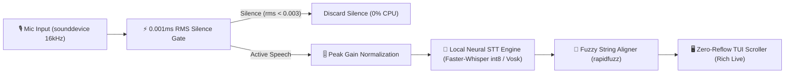

# clicue

**Speech-Driven Live Teleprompter Scroller for Screenplays & Scripts**

`clicue` is a lightweight, high-performance terminal teleprompter that list-scrolls Fountain screenplays and markdown documents live as you speak. Powered by local speech recognition engines and rapid fuzzy matching, `clicue` anchors your reading position with zero line reflow and ultra-low latency.

---

## ✨ Features

- **🎙️ Speech-Driven Auto-Scrolling**: Follows your voice live in real-time as you read your script.
- **🔒 100% Private & Local**: Runs entirely on your local machine CPU using local C++ engines (`Faster-Whisper` via CTranslate2 or `Vosk`). Zero audio data is sent to external servers.
- **📜 Fountain & Markdown Parser**: Native support for Fountain screenplay formatting (Scene Headings, Character Cues, Parentheticals) and Markdown (`*italics*`, `_italics_`, `**bold**`, `` `code` ``).
- **📺 Zero-Reflow Line-Anchored TUI**: Displays 1 line of previous context at the top and maximizes upcoming line visibility for an unobstructed reading experience.
- **⚡ Instant TUI Hotkeys**: Non-blocking keyboard controls for instant restart (`r`), pause (`Space`), seeking (`Left`/`Right`), and real-time latency debug overlay (`d`).
- **🔁 Last-Script Memory**: Re-open and continue your active script instantly with `clicue -c`.
- **📊 Performance Telemetry**: Built-in high-resolution performance logger (`clicue logs`) with automatic 7-day date-stamped file auto-purge.
- **🔄 Built-in Self-Updater**: Keep `clicue` up-to-date with `clicue self-up`.

---

## 🏗️ Local Audio Processing Pipeline Architecture

All audio capture and speech recognition run **100% locally** on your machine.



### Pipeline Workflow:

1. **Microphone Capture**: Captures 16kHz float32 audio blocks locally via `sounddevice`.
2. **RMS Energy Silence Gate**: A 0.001ms instantaneous root-mean-square (RMS) check filters out ambient noise and room silence before invoking the neural network, keeping idle CPU usage **< 0.5%**.
3. **Peak Gain Normalization**: Dynamically normalizes low-volume speech, boosting recognition accuracy for quiet speakers or low-gain USB microphones.
4. **Local Neural STT**: Speech buffers pass through local C++ inference models (`Faster-Whisper` quantized `int8` CPU engine or `Vosk` Kaldi engine).
5. **Sub-Millisecond Fuzzy Alignment**: Utterance text is matched against script words using `rapidfuzz` with a distance-penalized locality window (~0.06ms per match).
6. **Memoized Line-Anchored TUI**: Rendered via `rich` Live display with memoized line wrapping to prevent unnecessary Python allocations.

---

## 🚀 Installation

Install `clicue` globally using `uv` or `pipx`:

```bash
# Recommended (using uv):
uv tool install clicue

# Using pip:
pip install clicue
```

To update `clicue` to the latest PyPI release at any time:

```bash
clicue self-up
# or
uv tool upgrade clicue
```

---

## 📖 Usage & Examples

```bash
# Open a Fountain script (.fountain, .fountain.md, or .md) with default Vosk STT engine:
clicue script.fountain

# Use Faster-Whisper neural STT engine:
clicue script.fountain --whisper

# Open a Fountain markdown script:
clicue script.fountain.md

# Re-open and continue the last-used script:
clicue -c

# Continue last script with Faster-Whisper and live latency debug header:
clicue -c --whisper -d

# Inspect downloaded speech recognition models:
clicue models

# Inspect date-stamped performance log sessions:
clicue logs
```

---

## 🎮 Live TUI Keyboard Controls

While `clicue` is running, the keyboard is monitored with zero-latency non-blocking input:

| Key Shortcut | Action |
| :--- | :--- |
| **`r`** / **`0`** / **`Home`** | **Instant Restart**: Resets teleprompter cursor to word 0 and flushes audio buffers. |
| **`q`** / **`Esc`** | **Instant Quit**: Exits `clicue` immediately. |
| **`Space`** / **`p`** | **Pause / Resume**: Toggles auto-scrolling pause state. |
| **`Left`** / **`b`** | **Seek Backward**: Moves cursor back 5 words. |
| **`Right`** / **`f`** | **Seek Forward**: Moves cursor forward 5 words. |
| **`d`** | **Toggle Debug Overlay**: Displays live STT, Aligner, and Render latency stats in header. |

---

## 🛠️ CLI Options Reference

```text
USAGE:
  clicue <script.fountain | script.md> [options]
  clicue -c | --continue [options]
  cat script.fountain | clicue [options]

ARGUMENTS & OPTIONS:
  script                Path to script file (.fountain, .fountain.md, .md, or '-' for stdin).
  -c, --continue        Re-open and continue the last-used script file.
  --whisper             Shortcut for Faster-Whisper neural STT engine.
  --engine <name>        STT engine plugin ('vosk' or 'whisper'). Default: vosk.
  --model <name>         Model shortcut ('vosk-small', 'vosk-full', 'base.en', 'tiny.en').
  -d, --debug           Display real-time STT, Aligner, and Render latency in header.
  --perf-log            Enable date-stamped session performance logging.
  --raw                 Read text literally without parsing Fountain syntax.
  self-up / self-update Self-update clicue to latest PyPI version.
  models / purge-models List or purge downloaded STT models.
  logs                  Inspect date-stamped performance log sessions.
  -h, --help            Show help message and exit.
  -V, --version         Show clicue version details and exit.
```

---

## ⚙️ Configuration File

`clicue` can be configured via a TOML file at `~/.config/clicue/config.toml`:

```toml
[audio]
engine = "vosk"
model = "vosk-small"

[scroller]
window_size = 38
past_size = 9

[aligner]
max_lookahead = 20
threshold = 70.0
locality_penalty = 1.5

[debug]
perf_log = false
```

---

## 📄 License

MIT License. Built for creators, public speakers, and video producers.
